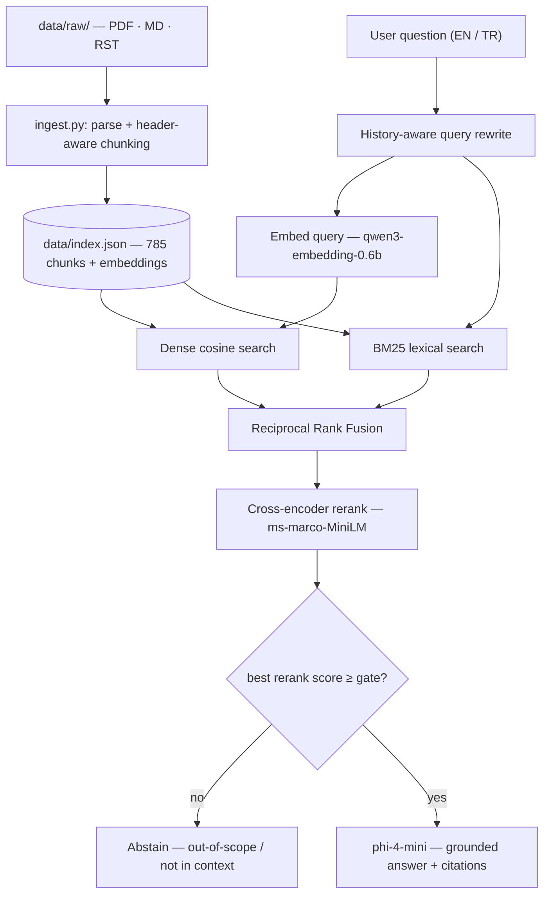

# AutoFlash RAG Assistant

A **fully offline** retrieval-augmented generation (RAG) assistant for **ECU diagnostics and UDS engineering knowledge**, running entirely on-device with [Microsoft Foundry Local](https://learn.microsoft.com/en-us/azure/foundry-local/). Ask questions about UDS services, OBD-II, CAN, DTCs, and ECU reflashing concepts in **English or Turkish** and get grounded, source-cited answers — with the system safely abstaining on out-of-scope requests.

**Author:** Emre Uludaşdemir · [GitHub](https://github.com/EmreUludasdemir) · [LinkedIn](https://www.linkedin.com/in/emre-uluda%C5%9Fdemir-297902284/)

> Still to fill in before publishing: the demo video link below, and a `LICENSE` file (see [License](#license)).

---

## Overview

AutoFlash RAG Assistant answers technical questions about automotive diagnostics from a curated, local knowledge base — no cloud APIs, no data leaving the machine. It combines hybrid retrieval (dense + lexical), cross-encoder reranking, and a confidence gate so it answers only what it can support from its documents and otherwise says "I don't know."

The project is intentionally scoped to **engineering and educational** content: UDS / ISO 14229 services, OBD-II, CAN, diagnostic trouble codes (DTCs), and conceptual ECU reflashing (service flow, checksums, calibration). Security-bypass material is deliberately excluded — see [Scope & Ethics](#scope--ethics).

---

## Demo

▶️ **2-minute walkthrough:** _[video link — add when recorded]_

Three representative interactions show the core capabilities:

**1. UDS service lookup (answered, with citations)**
```
> What does UDS service 0x19 do?
UDS service 0x19 (ReadDTCInformation) reads stored Diagnostic Trouble Codes
and their status from an ECU. ...
Sources: CAN Bus - The Ultimate Guide.pdf, udsoncan/udsoncan-intro.rst
```

**2. Reflashing concept (answered, with citations)**
```
> ECU calibration block flash edilirken checksum ne işe yarar?
Checksum/CRC, flash edilen block'un bütünlüğünü doğrular; bozuk veya eksik bir
transferi ECU'nun reddetmesini sağlar. Kalibrasyon değiştiğinde checksum'ın
yeniden hesaplanması gerekir. ...
Sources: ecu-diagnostics-flashing-concepts.md
```

**3. Out-of-scope request (safely refused)**
```
> What is the seed/key recovery algorithm for Simos18?
I don't know from the provided engineering context. Security-bypass material,
seed/key recovery algorithms, RSA-bypass, and bootloader-exploit details are
intentionally excluded from this corpus.
```

---

## Architecture



**Retrieval pipeline:** the query is embedded and searched two ways — **dense** (cosine over embeddings) and **lexical** (BM25, with a tokenizer that preserves identifiers like `0x19`, `0x22`, `dtc`). The two rankings are merged with **Reciprocal Rank Fusion (RRF)**, the top candidates are reordered by a **cross-encoder reranker**, and a **confidence gate** on the reranker score decides whether to answer or abstain. In multi-turn chat, an elliptical follow-up (e.g. *"what does it return?"*) is first rewritten into a standalone query so retrieval still works.

---

## Evaluation

All evaluation runs offline. Reproduce with the commands in [Setup & Run](#setup--run).

### Retrieval quality — `eval/retrieval_smoke.py`

Each stage of the pipeline measurably improves ranking (5 in-scope cases):

| Stage | hit@6 | MRR |
|---|:---:|:---:|
| Dense only | 4/5 | 0.69 |
| + BM25 hybrid (RRF) | 5/5 | 0.90 |
| + cross-encoder rerank | 5/5 | **1.00** |

The token-heavy `0x22` query is a clear example: dense-only missed it (rank 8), hybrid recovered it to rank 1.

### Confidence gate — in-scope vs. out-of-scope separation

| Query type | best rerank score |
|---|:---:|
| In-scope (e.g. UDS $19, checksum, DTC) | **3.63 – 6.75** |
| Out-of-scope (seed/key recovery) | **−2.99** |

With the gate at `0.0`, out-of-scope queries fall cleanly below it and the assistant abstains — the reranker score doubles as an out-of-scope detector.

### Answer quality — `eval/answer_quality_eval.py`

7 golden cases (English + Turkish), deterministic scoring:

| Check | Result |
|---|:---:|
| Passed | **7/7** |
| Citations present (when expected) | 7/7 |
| Expected terms present | 7/7 |
| Correct abstention (out-of-scope) | 7/7 |

### Unit tests — `pytest`

`pytest -q` → **9 passed**: RRF fusion ordering, BM25 tokenization, the confidence-gate decision, the out-of-scope security guard, and config invariants. No models are loaded, so the suite is fast and offline.

---

## Scope & Ethics

This assistant is built for **engineering and educational** use. The knowledge base intentionally contains **only** protocol, diagnostic, and conceptual material:

- UDS / ISO 14229 services, NRCs, sessions
- OBD-II PIDs and modes, CAN / ISO-TP basics
- DTC structure and reading
- Conceptual ECU reflashing: service flow, checksums, calibration, container formats

It deliberately **excludes** security-bypass content — seed/key recovery algorithms, RSA-bypass, bootloader/SBOOT exploits, and ECU unlock/patch workflows. Some source documents that contained such material were fetched and then removed during curation (tracked in [`data/SOURCES.md`](data/SOURCES.md)). Out-of-scope requests are refused at two layers: a confidence gate on retrieval, and a grounded prompt that answers only from the supplied context.

---

## Tech stack

- **Runtime:** Microsoft Foundry Local (`foundry-local-sdk-winml`)
- **Models (loaded by alias, run on CPU):** embedding `qwen3-embedding-0.6b`, chat `phi-4-mini`
- **Retrieval:** `rank-bm25` (BM25) + dense cosine + RRF; `sentence-transformers` cross-encoder (`ms-marco-MiniLM-L-6-v2`)
- **Ingestion:** `pymupdf4llm` (PDF → Markdown)
- **UI:** `streamlit` (multi-turn chat) + a CLI
- **Tooling:** `pytest`, centralized config, structured logging
- **Language:** Python 3.12

---

## Project structure

```
AutoFlash-RAG-Assistant/
├── src/
│   ├── ingest.py          # build the index from data/raw/
│   ├── retrieval.py       # dense + BM25 + RRF + cross-encoder rerank + gate
│   ├── main.py             # CLI chat
│   ├── app.py              # Streamlit UI (multi-turn, history-aware rewrite)
│   ├── config.py           # centralized config (env-overridable)
│   └── foundry_setup.py    # CPU-first Foundry Local model loading
├── eval/
│   ├── retrieval_smoke.py     # dense vs hybrid vs +rerank (hit@k, MRR)
│   ├── answer_quality_eval.py # citations / expected terms / abstention
│   ├── eval_set.json
│   └── answer_eval_set.json
├── tests/                  # pytest: RRF, tokenization, gate, security guard, config
├── data/
│   ├── SOURCES.md          # corpus provenance
│   └── raw/                # source documents (gitignored)
├── check_setup.py          # Foundry Local smoke test
├── requirements.txt
└── README.md
```

---

## Setup & Run

> **Windows** is assumed (Foundry Local / Windows ML). `data/raw/` is gitignored, so a fresh clone must first re-fetch the source documents listed in [`data/SOURCES.md`](data/SOURCES.md) before building the index.

```bash
# 1. Install Microsoft Foundry Local
winget install Microsoft.FoundryLocal

# 2. Create the Python environment
python -m venv .venv
.venv\Scripts\activate
pip install -r requirements.txt

# 3. (smoke test) confirm Foundry Local works
python check_setup.py

# 4. Build the index from data/raw/
python src/ingest.py

# 5a. Run the CLI
python src/main.py

# 5b. Run the Streamlit UI
python -m streamlit run src/app.py
```

**Reproduce the evaluation:**
```bash
python -m pytest -q
python eval/retrieval_smoke.py
python eval/answer_quality_eval.py
```

Configuration (model aliases, `TOP_K`, gate threshold, etc.) is centralized in `src/config.py` and overridable via `AUTOFLASH_*` environment variables.

---

## Engineering notes

A couple of decisions worth highlighting, because they were deliberate rather than accidental:

**Scale-appropriate storage.** At ~785 chunks, the index is a single JSON file searched with brute-force cosine plus BM25. A vector database (FAISS / Chroma / Pinecone) or a separate API layer would add real complexity and operational surface for **no measurable benefit** at this scale and in a single-user, fully-offline setting. Keeping it simple is the engineering choice, not a missing feature.

**Execution-provider investigation (CPU-first by design).** The `foundry-local-sdk-winml` runtime runs an embedded core that only exposes model variants for **registered** execution providers. With none registered, both models silently run on CPU. Attempting GPU acceleration on this build (RTX 5060, Blackwell) turned out to be a dead end, verified down at the ONNX Runtime GenAI layer: the CUDA GenAI companion fails to load (and lacks Blackwell `sm_120` kernels), and the WebGPU path reports *"WebGPU execution provider is not supported in this build."* The code is therefore **CPU-first and robust** — it selects the CPU variant explicitly regardless of EP state, with a WebGPU path kept behind an opt-in env var for a future SDK build. On CPU, short grounded answers return in roughly 8 seconds.

---

## Sources

The corpus is built from openly available engineering documentation — `python-udsoncan` docs, CSS Electronics CAN/OBD-II/UDS guides, the Wikipedia OBD-II PIDs reference, and an original conceptual ECU-diagnostics note written for this project. Full provenance is tracked in [`data/SOURCES.md`](data/SOURCES.md). Source documents themselves are not redistributed in the repository.

---

## License

MIT — add a `LICENSE` file if you want this to be explicit. Source documents retain their respective upstream licenses (see `data/SOURCES.md`).
